# 基于SpringBoot+Vue的常规应急物资管理系统

---
### 👉作者QQ ：1556708905 微信：zheng0123Long (支持定制修改、部署调试、定制毕设)

### 👉接网站建设、小程序、H5、APP、各种系统等

---

#### 介绍

在面对各种突发事件时，高效、准确地管理应急物资对于保障救援工作的顺利进行和人民生命财产的安全至关重要。本基于 Spring Boot + Vue 的常规应急物资管理系统应运而生，旨在为应急物资的管理提供一个信息化、智能化的解决方案，提高物资管理的效率和准确性，确保在关键时刻能够迅速调配所需物资。

#### 技术栈

后端技术栈：Springboot+Mysql+Maven

前端技术栈：Vue+Html+Css+Javascript+ElementUI

开发工具：Idea+Vscode+Navicate

#### 系统功能介绍

（一）管理员角色  
个人中心：管理员在此可以查看和修改个人信息，如密码、联系方式等，同时能够查看自己的操作记录和系统通知。  
健康打卡管理：查看所有用户的健康打卡情况，对未按时打卡的用户进行提醒和督促，以确保在应急情况下人员的健康状况得到及时掌握。  
基础数据管理：负责维护系统的基础数据，包括物资分类、物资规格、部门信息、仓库信息等，为物资管理的规范化和标准化提供支持。  
物资管理：对各类应急物资进行全面管理，包括物资的入库、出库、库存盘点、物资信息更新等，实时掌握物资的数量、状态和位置。  
物资申请管理：审核用户提交的物资申请，根据库存情况和实际需求决定是否批准申请，并对申请的处理过程进行跟踪和记录。  
物资运输管理：安排物资的运输计划，包括选择运输方式、确定运输路线、调配运输人员和车辆等，确保物资能够及时、安全地送达目的地。  
用户管理：对系统用户进行管理，包括添加新用户、修改用户信息、设置用户权限、删除用户等操作，保障系统用户的合法性和安全性。  
部门管理：对使用应急物资的各个部门进行管理，包括部门的设立、撤销、部门职责的明确等，以便更好地协调物资的分配和使用。  

（二）用户角色  
个人中心：用户可以修改个人资料，查看自己的申请记录、运输记录等相关信息。  
健康打卡管理：每天按时进行健康打卡，上报个人健康状况，为应急工作中的人员调配提供参考。  
物资管理：查看物资的详细信息，了解物资的种类、数量、存放位置等，以便根据实际需求申请物资。  
物资申请管理：根据工作需要向管理员提交物资申请，说明申请物资的种类、数量、用途和紧急程度等。  
物资运输管理：在物资运输过程中，用户可以查看运输进度和相关信息，确保物资能够按时到达指定地点。  

#### 系统作用

学生干部管理系统的主要作用包括：  

提升管理效率： 为管理员提供全面的管理工具，帮助高效管理学生干部信息、公告、留言、信访举报和组织评价，确保信息的准确性和及时性。  
优化学生干部管理： 通过系统化的学生干部管理和职位分配，帮助学校更好地选拔和管理学生干部，提升管理水平和学生干部的工作积极性。  
促进信息透明化： 提供便捷的查询和管理功能，使学生干部可以随时查看个人信息、公告和留言，提升信息透明度。  
简化信访举报流程： 通过信访举报管理模块，简化信访举报的提交和处理流程，提高举报的处理效率和结果反馈。  

#### 系统功能截图

代码结构

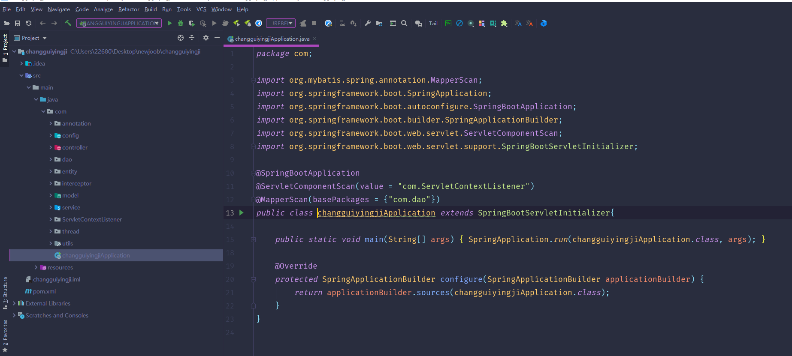

数据库表

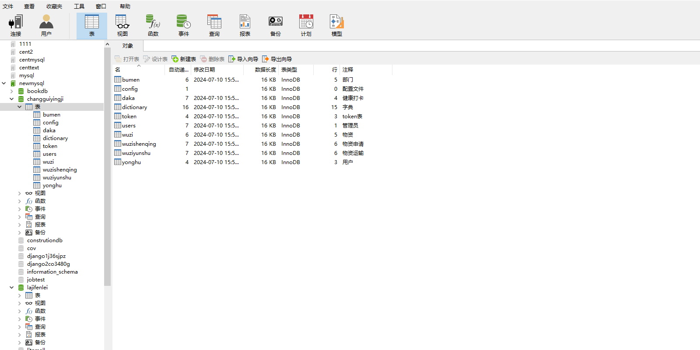

登录

健康打卡管理

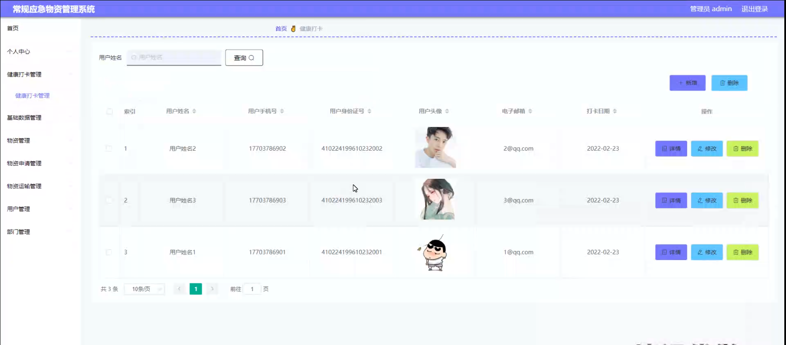

物资类型管理

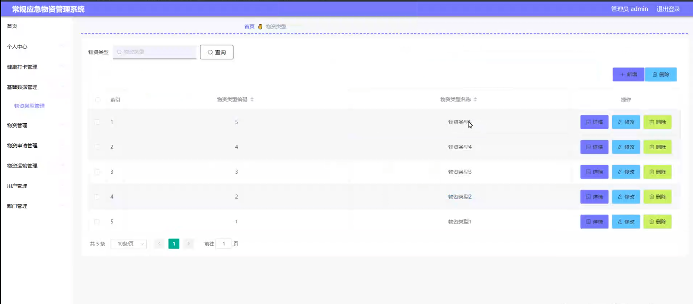

物资管理

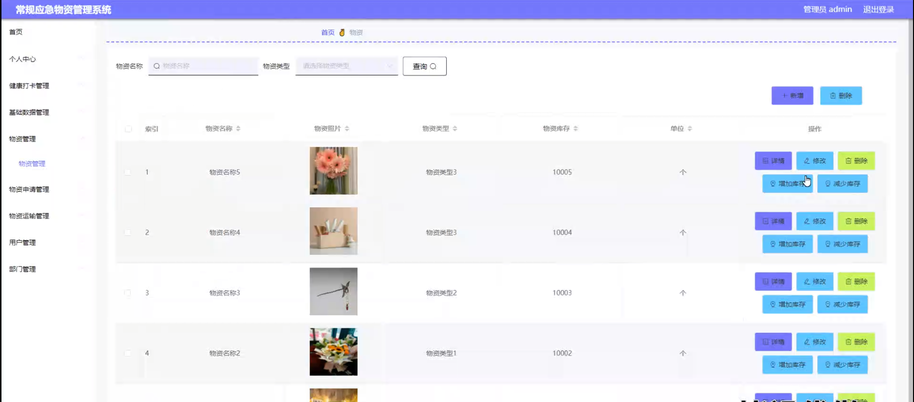

物资申请管理

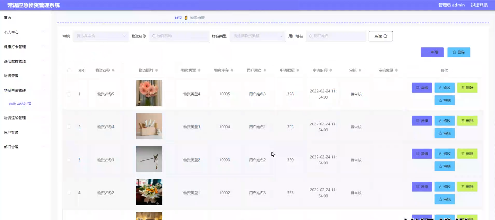

物资运输管理

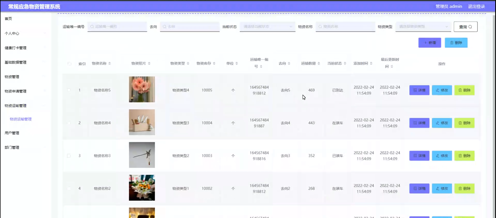

用户管理

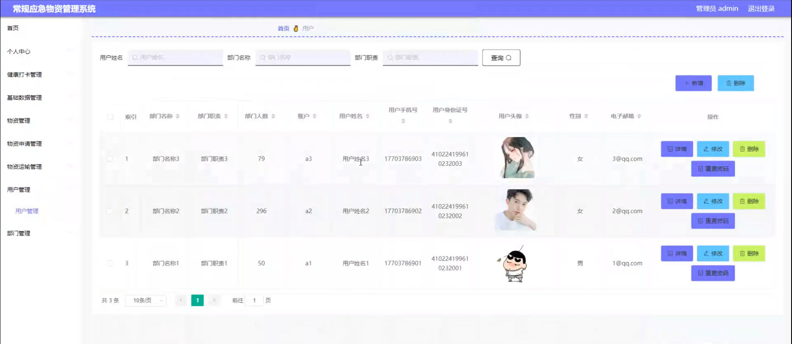

部门管理

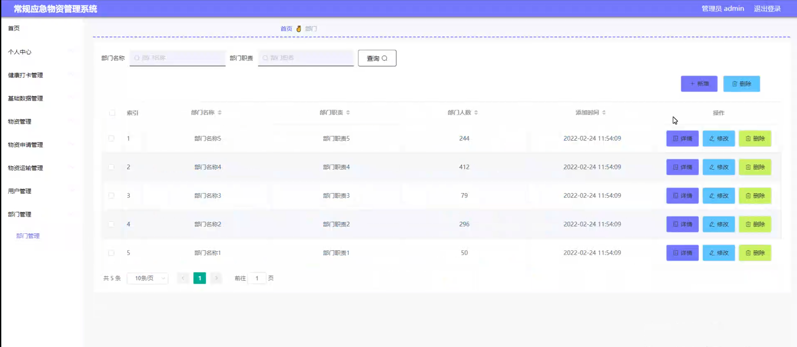

用户端健康打卡管理

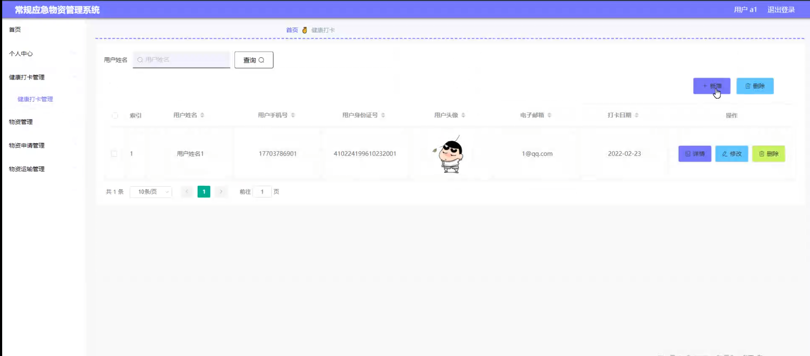

物资运输管理

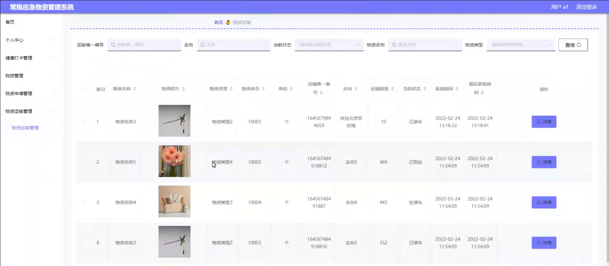

#### 总结

基于 Spring Boot + Vue 的常规应急物资管理系统通过清晰的角色划分和丰富的功能模块，为应急物资管理提供了一体化的解决方案。管理员能够全面掌控物资的各个环节，进行科学决策和有效管理；用户能够便捷地申请和跟踪物资，参与到物资管理的过程中。该系统有助于提高应急物资管理的水平和效率，为应对突发事件提供有力的物资保障。

#### 使用说明

创建数据库，执行数据库脚本 修改jdbc数据库连接参数 下载安装maven依赖jar 启动idea中的springboot项目

后台登录页面
http://localhost:8080/changguiyingji/admin/dist/index.html

管理员			账户:admin 	密码：admin
用户				账户:a1 		密码：123456
用户				账户:a2 		密码：123456
用户				账户:a3 		密码：123456